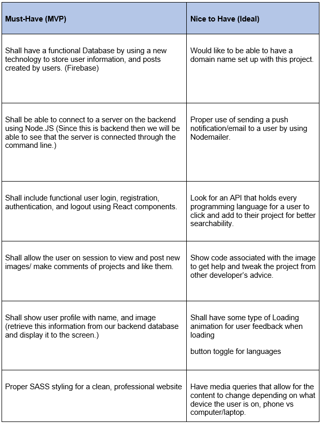
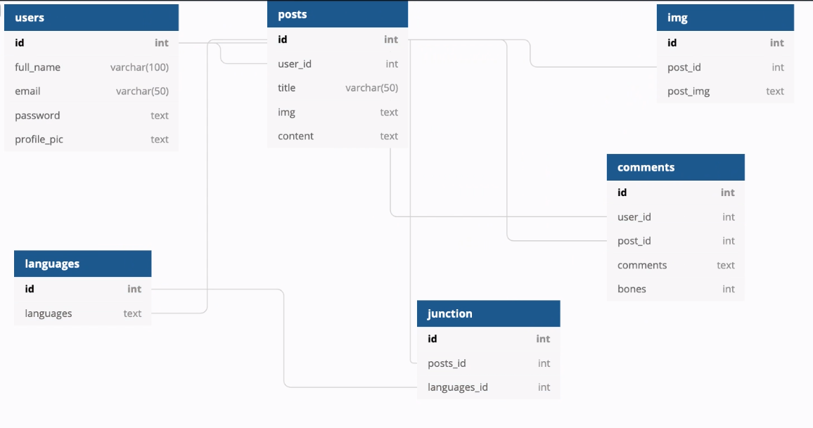

# CodePound- Group Project
## Members:
Benjamin Doggett, Eric Camp, Jason Towner, Paul Brooks

## IDEA and USER:
Welcome to the CodePound! A social media site geared toward developers and the ability for said developers to share the creative projects they have built throughout their careers. The CodePound is comparable to Instagram in sense of the post comment/ like of each project (the “like” can be a “bone” or something to set itself apart) However, not only does it allow developers to share projects, but receive feedback and or help on projects in order to better refine these projects for live hosting. Thus, when employers or others see these projects there is a more polished project backed by a community of developers who are helping one another grow... Also great for any developer hoping to get some extra teaching experience and learn some new things by helping other developers.

## Features:



## Tree / Controller-WireFrame / Mockups
### Tree


### Controller


### Mockups
### Sign in component


### Register component


### Home component


### Profile component


## Schema (DataBase Design):


### Users TABLE
```SQL
CREATE TABLE users(
    id SERIAL PRIMARY KEY,
    full_name VARCHAR(100),
    email VARCHAR(50)
    password TEXT,
    profile_pic TEXT
);
```

### Posts TABLE 
```SQL
CREATE TABLE posts(
    id SERIAL PRIMARY KEY,
    user_id INTEGER REFERENCES users(id),
    title VARCHAR(50),
    img TEXT,
    content TEXT
);
```

### Comments TABLE
```SQL 
CREATE TABLE comments(
id SERIAL PRIMARY KEY,
user_id INTEGER REFERENCES users(id),
post_id INTEGER REFERENCES posts(id),
comments TEXT,
bones INTEGER
);
```

### image TABLE 
```SQL 
CREATE TABLE image (
  id SERIAL PRIMARY KEY,
  post_id INTEGER,
  post_img TEXT
);
```

### languages TABLE 
```SQL
CREATE TABLE languages (
  id SERIAL PRIMARY KEY,
  languages TEXT
);
```

### junction TABLE 
```SQL
CREATE TABLE junction (
  id SERIAL PRIMARY KEY,
  posts_id INTEGER,
  languages_id INTEGER
);
```
